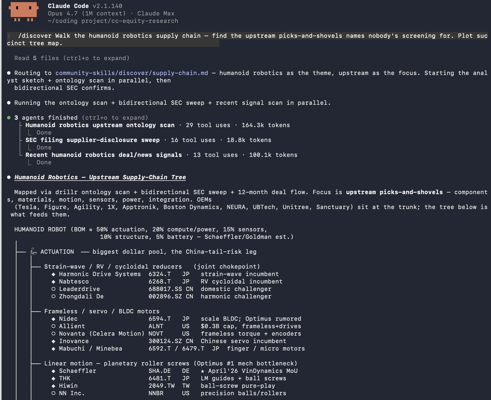

# CC Fintech Research Toolkits

[English](README.md) | **日本語** | [简体中文](README.zh-CN.md)

**100%無料、セルフホスト、Claude Code ネイティブ、グローバル株式市場対応（米国・香港・中国A株） — Anthropic 公式の株式リサーチスキルをすべての投資家に開放します。yfinance + HKEX + FRED + NewsAPI + RSS による完全無料のローカルデータMCPサーバーを搭載し、セルサイドアナリスト、ポートフォリオマネージャー、個人投資家、アカデミックエコノミストのいずれにも対応するパーソナライゼーション層を組み合わせました。**

<br>



3 つのコンポーネントで構成されています。

1. **スキルライブラリ。** 24 種類の分析ワークフロー。Anthropic 公式の Apache 2.0 ライセンス株式リサーチバンドル（9 スキル）と、コミュニティが育てている拡張ライブラリ（14 スキル）。アイデア発掘、個別企業の深掘り、ポジション管理、マクロ・リサーチを一通りカバーします。

2. **誰でも使えるインターフェース。** Claude は使い手の金融リテラシーと好みに合わせて、トーン・深さ・専門用語の濃度を切り替えます。セルサイドアナリスト、ポートフォリオマネージャー、個人投資家、アカデミックエコノミストのいずれにも対応。`/probe`、`/dive`、`/track`、`/landscape` の 4 つの統合スラッシュコマンドが、自然言語の依頼を 24 スキルへ自動でルーティングします。

3. **ローカル無料データ MCP。** 自マシン上で動作するセルフホスト型の無料 MCP サーバー。yfinance（香港株式行情・ファンダメンタルズ）、HKEX ディスクロージャー（公告・決算）、FRED（マクロ金利データ）、NewsAPI + RSS（ニュース・センチメント）を統合。**すべて無料、ゼロサブスクリプション**。米国株式（SEC EDGAR + FRED マクロ完全対応）、香港株式（.HK）65 銘柄、A 株連動銘柄をカバーします。個人ユーザーは API Key なしで基本機能を利用でき、FRED・NewsAPI の高度機能はオプションで無料 API Key を設定するだけです。

---

## なぜこれを作ったか

Anthropic は先日、優れた[株式リサーチ・スキルバンドル](https://github.com/anthropics/financial-services/tree/main/plugins/vertical-plugins/equity-research)をオープンソース化しました。イニシエーション・ノート、決算分析、カタリストカレンダー、モーニングノート、テーゼ・トラッカーなど、9 種類の機関投資家向けワークフローテンプレートです。Claude Code の株式リサーチ能力の上限を一気に引き上げる内容ですが、課題が 2 つ残ります。

1. **データコネクタが高額。** Anthropic のスキルはあくまで方法論であり、データは同梱されていません。コネクタは自前で用意する必要があります。Anthropic 公式の[リファレンスリポジトリ](https://github.com/anthropics/financial-services/blob/main/plugins/vertical-plugins/financial-analysis/.mcp.json)は、これらのスキルを **11 種類の機関投資家向け MCP** に接続しています。FactSet、LSEG、S&P Global、Morningstar、Moody's、PitchBook など、**1 シートあたり年額 1.5〜3 万ドル**が相場で、合計すると 15 万ドルを優に超えます。独立系アナリスト、アカデミックエコノミスト、機関投資家予算なしで本格的なリサーチを回したい人には手が届きません。

2. **セルサイド前提で、可搬性のあるインターフェースがない。** バンドルのテンプレートは、株式リサーチデスクの日々のアウトプット（イニシエーション・ノート、モーニングノート、決算プレビュー）を前提に設計されています。**概念**は普遍ですが、**用語**（実績／予想を示す A/E 表記、ベーシスポイント (bp) の略記、セルサイドレポート固有の構成）は、個人投資家やアカデミックの探索的な企業調査には敷居が高く映ります。デフォルトの状態では、エージェントが使い手のリテラシーや好みに合わせてくれません。

このプロジェクトは両方を解決します。**ローカル無料 MCP サーバー**が 11 種類の有料 MCP スタックを 1 つのセルフホスト型コネクタに統合し、完全無料で提供。記憶駆動のインターフェース層が、出力の語り口をキーボードの先にいる人に合わせます。

---

## Quick Start

1. Claude Code をインストール
2. `git clone https://github.com/fredtai/Fintech-research.git`
3. `cd Fintech-research`
4. `pip install -r requirements.txt`
5. `claude`
6. Claude Code で `/mcp` を実行してローカル server を確認
7. `/probe`、`/dive`、`/track`、`/landscape` を直接使用

---

## インストール

[Claude Code](https://claude.com/claude-code) のインストールが必要です。

```bash
git clone https://github.com/fredtai/Fintech-research.git
cd Fintech-research
pip install -r requirements.txt
claude
```

Claude Code 内で `/mcp` を実行し、ローカル MCP サーバーの接続状況を確認してください。`.mcp.json` にサーバーが宣言済みのため、Claude Code は起動時にこれを自動で検出します。個人ユーザーは基本機能を API Key なしで利用できます。準備ができたら、やりたいことをそのまま入力するか、4 つのスラッシュコマンドのいずれかを叩いてください。

---

## インターフェース — 4 つのスラッシュコマンド

各コマンドは、そのカテゴリ内の短いレンズメニューを開きます。名前で選んでもいいですし、やりたいことを自然言語で書けばディスパッチャーが自動でルーティングします。

| コマンド | カテゴリ | カバー範囲 |
|---|---|---|
| `/probe` | アイデア発掘 | テーマ、サプライチェーン、代替プレー。Anthropic の `idea-generation`（システマティック・スクリーン）、`sector-overview` を含む |
| `/dive` | 個別企業の深掘り | ビジネスモデル、決算スコアカード、フォレンジック、開示クオリティ、経営陣。Anthropic の `initiating-coverage`、`earnings-preview`、`earnings-analysis`、`model-update` を含む |
| `/track` | ポジション・トラッキング | ウォッチリスト、テーゼ・チェック、イベント・レーダー。Anthropic の `thesis-tracker`、`catalyst-calendar`、`morning-note` を含む |
| `/landscape` | マクロ・リサーチ | イールドカーブ、貿易フロー、労働市場、マクロ全景 |

**自然言語でもそのまま通ります。**「騰訊（0700.HK）にフォレンジックをかけて」「アリババ（9988.HK）の今後 6 週間のカタリストは？」「香港ドルの金利差で不動産セクターにどう影響するか」といった依頼に対し、Claude は `CLAUDE.md` のインテントマップから該当スキルへ直接ルーティングします。スラッシュコマンドは発見性のレイヤー、自然言語はパワーユーザーのレイヤーで、下にあるのは同じスキルです。

例：`/dive 0700.HK forensics` で騰訊にフォレンジックを実行。`/landscape` でマクロメニューを開く。`/probe 半導体製造装置で何が効いているか` だと `themes` にルーティングされます。

**スキルが増えても、スラッシュコマンドは 4 つのまま。** 新しいスキルはディスパッチャー内部に追加され、コマンド自体が増えることはありません。

---

## モード — 使い手に合わせる

2 つのプロジェクトローカル・ファイルが、すべての応答の形を決めます。これが課題 2、つまり同じ分析的厳密さを相手に合った語り口で返すためのレイヤーです。

- **`.claude/mode.md`** — `new`（デフォルト）はセッション開始時にオリエンテーションを表示し、`experienced` はそれをスキップします。ファイルを編集するか、Claude に「もう慣れた」と伝えれば切り替わります。
- **`.claude/style.md`** — 4 つのフィールドで Claude の話し方を制御します。`experience`（experienced / intermediate / learning）、`depth`（quick / balanced / deep）、`tone`（professional / institutional / conversational / educational）、任意の `coverage`（カバーセクター：global / hk-only / us-only）。デフォルトは「専門的だが、わかりやく」設定です。

Claude はセッション開始時に両方を読み、毎ターン適用しつつ、会話の途中でも好みの変化を吸収します。A/E 表記をカジュアルに使い始めれば `tone` は `institutional` に昇格。用語の意味を尋ねれば `experience` は `intermediate` にシフト。ファイルが更新され、変更点は 1 行で伝えられます。

> 補足：これらのファイルは*プロジェクトローカル*です。リポジトリ内に置かれており、Claude Code のセッション横断オートメモリには入りません。別のマシンで clone する場合、リポジトリを同期しない限り、まっさらな状態から始まります。

---

## スキル

**Anthropic バンドル**（`anthropic-equity-research-skills/`）— [`anthropics/financial-services`](https://github.com/anthropics/financial-services)（Apache 2.0）から取り込んだ 9 種類のワークフローテンプレート：`initiating-coverage`、`earnings-preview`、`earnings-analysis`、`model-update`、`morning-note`、`catalyst-calendar`、`thesis-tracker`、`idea-generation`、`sector-overview`。

**コミュニティ拡張**（`community-skills/`）— アナリストが寄稿した 14 種類のレンズを 4 領域に整理：`probe/`（themes、supply-chain、alt-plays）、`dive/`（business-model、earnings-scorecard、financial-forensics、reporting-quality、management）、`track/`（watchlist、thesis-check、event-radar）、`landscape/`（yield-curve、trade-flows、labor-market）。

各スキルは短い Markdown ファイルです。1 つ読めば、何をするか正確に分かります。

---

## データ — ローカル無料 MCP サーバー

1 つのセルフホスト型 MCP サーバーがすべてのスキルを支えます。5 つのデータドメイン：

**P0 — コア市場データ（無料、API Key 不要）**
- **yfinance** — 香港株式（.HK）65 銘柄のリアルタイム行情、ファンダメンタルズ（損益計算書／貸借対照表／キャッシュフロー計算書）、60 以上の標準化指標、コンセンサス予想、ヒストリカルプライス
- **HKEX ディスクロージャー** — 公告（Announcements）、決算（Financial Reports）、通報（Circulars）を全文検索可能。ハンセン指数トップ 50 + テック銘柄をカバー

**P1 — マクロデータ（無料枠あり）**
- **FRED** — マクロ金利データ（連邦基金金利、国債利回り、LIBOR/SOFR）、景気指標（GDP、インフレ、雇用統計）
- **HKMA** — 香港ドル為替レート、香港金利、HKMA 政策データ

**P2 — ニュース・センチメント（無料枠あり）**
- **NewsAPI** — グローバル金融ニュース、センチメント分析ソース
- **RSS フィード** — 金融系ニュースサイト、IR サイト、規制開示のリアルタイム購読

すべてのデータソースは**完全無料・ゼロサブスクリプション**です。個人ユーザーは `pip install -r requirements.txt` で依存パッケージをインストールするだけで基本機能が使えます。FRED・NewsAPI の高度機能（より広範なヒストリカルデータ、高度なクエリ）を使いたい場合は、各サービスの無料 API Key をオプションで設定するだけです。

**カバー範囲：**
- **香港株式（主力）**：65 銘柄の .HK ティッカー（ハンセン指数トップ 50 + テック銘柄）。AH スプレッド分析対応
- **米国株式**：NYSE・NASDAQ 上場銘柄
- **A 株連動**：香港上場の中国企業銘柄を通じた A 株市場連動分析
- **日本株式（セカンダリ）**：東証プライム主要銘柄

SQL を書く必要はありません。欲しいものを言葉で伝えれば、スキル実行時に Claude が裏でローカル MCP サーバー経由でデータを取得します。SEC EDGAR 対応により米国株式の法定開示書類（10-K、10-Q、8-K、プロキシ、S-1）も全文検索可能です。

---

## コントリビュート

コミュニティスキルへの貢献は大歓迎です。実務アナリストが自分の手の内を共有することで、ツールキットの切れ味が磨かれていく領域です。

新しいコミュニティスキルを追加する際は、3 つの小さな編集をお願いします。

1. `community-skills/<area>/` にスキルファイル本体を追加
2. `CLAUDE.md` のキャパビリティマップに 1 行追加
3. `.claude/commands/<area>.md` のディスパッチャーメニューに 1 行追加

その上で PR を送ってください。Anthropic バンドルはアップストリームから取り込んだものなので、そちらへの変更提案は [`anthropics/financial-services`](https://github.com/anthropics/financial-services) に出してください。

スキルテンプレート、良いスキルの基準、レビューの観点については `CONTRIBUTING.md` を参照してください。

---

## ライセンス

ツールキット本体（コミュニティスキル、スキャフォルディング、ディスパッチャー、ドキュメント、ローカル MCP サーバー）は **Apache 2.0** ライセンスです。トップレベルの `LICENSE` ファイルを参照してください。取り込んでいる Anthropic 株式リサーチバンドルも Apache 2.0 です。帰属表示とアップストリーム同期コマンドは `anthropic-equity-research-skills/NOTICE.md` を参照してください。

---

## About

本プロジェクトが基盤としているもの：

- **[anthropics/financial-services](https://github.com/anthropics/financial-services)** — Anthropic 公式のオープンソース株式リサーチスキルバンドル。`anthropic-equity-research-skills/` に取り込んでいます（Apache 2.0）
- **ローカル無料 MCP サーバー** — yfinance + HKEX + FRED + NewsAPI + RSS を統合したセルフホスト型データサーバー。すべて無料、ゼロサブスクリプション
